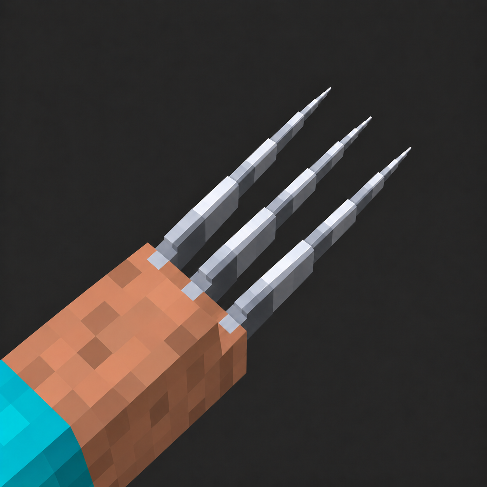

# Wolverine: Claws & Healing · 金刚狼：钢爪与自愈

**本模组由 AI 辅助制作。 / This mod was created with AI assistance.**

**Minecraft 1.20.1 · Forge 47.4.0+ · Java 17 · r66 Beta**

[下载 r66 / Download r66](https://github.com/xiangwenquan830-dev/wolverine-claws-healing/releases/tag/r66)

## 中文介绍

注射金刚狼血清，永久获得随角色保存的再生能力与艾德曼合金钢爪。能力在死亡重生和重新登录后保留，不依赖指定护甲。

- 钢爪战斗：双爪、单爪与符合条件的持物组合，三段连招、重击和飞扑。
- 自动自愈：基础恢复、再生储备与低血量恢复机制；高额瞬间伤害仍可能致命。
- 格挡与反击：普通格挡积累负担，精准格挡提供反击机会。
- 墙面移动：攀爬、横移、单爪悬挂与满足碰撞条件的翻越。
- 第一、第三人称钢爪表现、声音反馈、可配置 HUD 与身体伤口显示。
- 包含枪爪相关兼容路径；第三方枪械、特殊枪臂及整合包仍需逐项实测。Better Combat 为可选兼容，不是必需依赖。Darwin Soldier 桥接不代表无视其闪避或战斗直觉。

## r66 更新

本次更新基于 r65，集中改进伤口材质与显示配置。

- 加强一级、二级伤口：默认覆盖档的实际着色面积相对 r65 分别增加约 35.5% 和 55.8%；一级、二级不露骨。
- 同部位、同方向、同覆盖档保持一级范围包含于二级、二级包含于三级，三级原图保持不变。
- 统一为唯一默认显示方案。获得能力后受伤即可显示，无需额外风格或露骨开关。
- 保留身体伤口总开关、第一/第三人称、覆盖档与透明度设置。旧配置明确关闭总显示时继续关闭，无需删除配置。
- 清理运行包中的旧风格和重复图集。此次相对 r65 不调整战斗、自愈、枪爪时序、动画、模型、格挡、攀爬与达尔文联动规则。

## 安装与验证范围

备份存档与配置，退出游戏，将旧金刚狼 JAR 移出 mods，只放入 `wolverine-forge-1.20.1-r66.jar`。客户端与服务器使用匹配版本，保留原有配置与能力数据。ZIP 不放入 mods。

**Beta：**随附 r66 记录报告正式构建与离线回归通过；本次发布核对了版本、文件大小与 SHA-256，未重新执行构建或游戏测试。真实客户端、专用服务器、多人联机、中文 Windows 与用户整合包仍未完成本轮实机验收。

## English

Inject Wolverine serum to unlock persistent claws and regeneration. Fight with claw combos, heavy attacks and pounces, block and parry, climb walls and mantle when collision checks allow. Includes first- and third-person presentation, configurable HUD, and visible healing wounds.

r66 strengthens stage-one and stage-two wound textures and unifies wound rendering into one default style. At default coverage, colored area increases by approximately 35.5% and 55.8% relative to r65. Stage-three artwork is preserved. Existing users who disabled body wounds remain opted out; first/third-person visibility, coverage and opacity controls remain available. Combat, healing, gun/claw timing and movement rules are unchanged relative to r65.

Use Minecraft 1.20.1, Forge 47.4.0+ and Java 17. Back up your world and settings, remove the previous JAR, and install only the new JAR. Match client/server versions. Keep ZIP archives out of mods.

**Beta testing status:** supplied delivery records report a successful build and offline regression checks. This publication verifies version and artifact hashes only; actual client, dedicated-server, multiplayer, Chinese Windows and modpack testing remains outstanding for this iteration.

## 文件与许可 / Files and license

- `wolverine-forge-1.20.1-r66.jar`：安装文件 / playable mod binary.
- `wolverine-forge-1.20.1-r66-project.zip`：作者提供的 r66 工程导出，含源码与随附资料。它不是交付说明中单独列出的 development ZIP；未独立验证完整可复现构建。 / Supplied r66 project export, including source and accompanying materials; not the separately documented development ZIP. Reproducible build completeness has not been independently verified.
- GitHub 自动生成的 Source code 压缩包只包含本仓库说明和封面，不是模组工程。 / GitHub's automatic source archives contain this documentation repository, not the mod project.

JAR SHA-256: `910aa2508a50c2cf4501c429f1d9262527a5f9d220917284c0c7c3a115227147`

模组元数据声明 All Rights Reserved；JAR 内第三方声明继续适用。 / Mod metadata declares All Rights Reserved; bundled third-party notices still apply.
